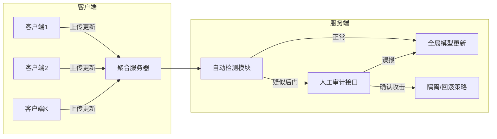
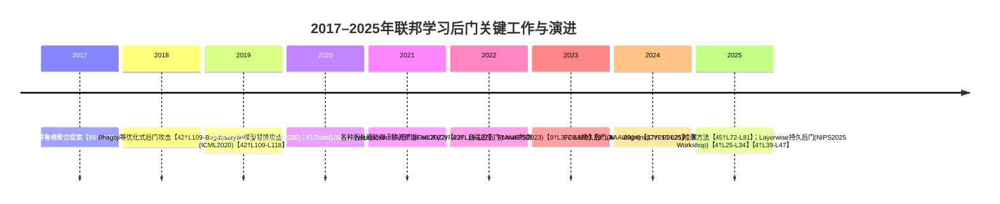

# 执行摘要

联邦学习（FL）的分布式隐私特性同时带来安全挑战，尤其是**持久性**（后门能否在多轮训练后长期存在）与**自适应性**（攻击者能否针对防御机制调整攻击）后门攻击。本文系统梳理2017–2025年相关研究与实践，重点回答：①如何建模隐蔽且可持续多轮的自适应后门攻击；②现有防御技术与方案的分类与效果；③在不损失良性精度前提下，后门消除面临的核心瓶颈；④工业级系统中动态检测和人工审计相结合的可行框架。我们提出攻击者能力假设列表、对比主要攻击建模方法（如层次投毒、触发器优化等），并分类综述鲁棒聚合、检测剔除、模型修复等防御技术。通过表格整理各方法假设、对抗模型、对良性精度影响、检测率/误报率、开销和开源情况等指标。分析指出非IID数据、鲁棒性-精度权衡、自适应绕过和评估基准不足等均为关键瓶颈。最后给出工业部署建议，包括系统架构和审计流程（以Mermaid流程图示意），并在结论中提出未来研究方向及可操作建议。

## 1. 自适应持久后门攻击的建模

攻击者通过控制部分客户端，在其本地训练集中注入触发样本或直接篡改模型更新，从而在全局模型中植入后门。针对“中央服务器不可见、能绕过异常检测”的自适应后门，常见假设及建模要素包括：  
- **控制客户端比例**：攻击者可能控制少数（如5–25%）客户端，或采用逐轮轮换控制（如每轮控制一个设备【27†L327-L335】【26†L342-L350】）；  
- **模型参数篡改**：可对本地更新进行任意修改，如**模型替换**（scale模型梯度以覆盖均值）【19†L176-L184】或**梯度投影**（如Neurotoxin将恶意梯度投影到非主流参数方向以提高持久性）【22†L19-L27】【22†L77-L86】；  
- **多轮持续**：攻击可持续多轮注入，或只是“打一次”的单轮攻击后通过优化提升后门留存性（持久性）；例如FCBA通过组合分布式触发器，即使在单次注入场景也能让后门在120轮后保持高准确率【17†L13-L21】【17†L25-L33】；  
- **触发器类型**：触发器可以是像素水印（图像）、关键字序列（文本）等。新型攻击通过**可适应触发器**，如A3FL动态优化触发器使其更适应全局模型变化【9†L372-L380】【9†L343-L351】；  
- **全局模型/聚合规则知识**：部分工作假定攻击者可观察到当前全局模型（或其更新），并在此基础上优化攻击【9†L372-L380】；而有的只利用本地信息，不需要服务器细节。【19†L158-L166】  
- **多客户端协同**：分布式后门（DBA）攻击将全局触发器拆分成多个本地子触发器，由多个恶意客户协作注入；FCBA更进一步，使用组合学生成多种子触发器并分配给不同客户端，以增强后门完整性【19†L222-L231】【19†L264-L272】；  
- **操纵数据分布**：攻击者可以在本地数据中嵌入后门样本（数据投毒），并可能调整本地学习率等超参来提高后门效果【19†L156-L164】【19†L222-L231】。

不同方法在**目标函数、损失函数和隐蔽性约束**上的区别：早期工作如**模型替换**（Bagdasaryan et al. 2020）通过将本地更新放大逼近全局模型差值，高效植入后门但易被多轮训练稀释【42†L109-L118】【19†L176-L184】；**分布式触发（DBA）**（Xie et al. 2020）将触发器拆成碎片，分别注入不同客户端，以拼合全局后门，但常在注入后快速衰减【19†L222-L231】；**一行代码后门（Neurotoxin）**（Zhang et al. 2022）通过仅攻击训练中更新较小的参数，显著延长后门寿命（持久性提升 2倍到5倍）【22†L19-L27】【26†L381-L390】；**自适应优化触发器（A3FL）**（NeurIPS 2023）针对全局模型动态，利用对抗式目标函数调整触发器，使其在全局模型持续更新中依然高效【9†L366-L374】【9†L343-L351】。FCBA（AAAI 2024）使用**全组合触发器**，通过组合分布式触发块生成更完整的全局后门模式，大幅提升后门持久性【19†L222-L231】【17†L13-L21】。大多数攻击目标函数都包含对分类损失的最小化，并辅以正则项或梯度投影以限制与全局模型偏离，以维持隐蔽性。例如A3FL使用L2正则限制本地模型与全球模型偏差【9†L380-L389】，Neurotoxin则通过掩码或投影避免触及常更新的参数子空间，从而降低被更新覆盖的概率【22†L19-L27】。评估指标通常包括**后门攻击成功率（ASR）**以及后门效果随训练轮数衰减的**持久性（Lifespan）**【17†L17-L21】【27†L353-L362】。例如FCBA在三分类任务的120轮后门持久性提升分别为+34.9%、+8.8%、+56.8%，极大优于Baseline【17†L17-L21】；Neurotoxin在LSTM-Reddit任务中将后门寿命从基线的32轮延长至122轮【26†L422-L430】。总体来看，更高的隐蔽性和持久性通常需要复杂优化和更强假设（如多客户端协同、灵活调整触发器等），但这些也为防御带来挑战。

## 2. 有效的防御技术及分类

当前已提出的联邦学习后门防御技术可归为以下几类，每类简述原理、适用场景、优缺点及其在非IID与高隐蔽性攻击下的效果：

- **鲁棒聚合（Robust Aggregation）**：该类方法设计新的聚合规则，减少恶意更新的影响。典型算法有**Krum**（NIPS 2017）、**Trimmed Mean/Median**（ICLR 2019）、**Multi-Krum/Bulyan**、**FLTrust**（USENIX 2020）、**FoolsGold**（ICLR 2020）等。  
  - *原理*：Krum从所有客户端更新中挑选“最接近其它更新”的一个更新；Trimmed Mean在每个维度上舍弃最大/最小若干值后取平均；Median取中值；FLTrust假设服务器有小规模可信数据，用其更新建立“参考更新”，然后将其他客户端更新与之校准；FoolsGold通过对客户端历史梯度相似度评估，根据怀疑程度动态降低可疑客户端的学习率。  
  - *优缺点*：这些方法无需额外数据、自动化程度高，对随机攻击有一定抵抗力。但在**非IID**场景下常误判正常差异为异常，导致模型精度下降【55†L126-L135】【40†L74-L82】；攻击者如Bagdasaryan等指出，Krum等假设IID的安全聚合，在真实FL场景中往往效果有限【42†L136-L142】【42†L147-L156】。FLTrust效果较好，但要求服务器端可信数据集，这在实务中常难以满足；FoolsGold仅针对**欺骗式(Sybil)**攻击有效，当恶意客户端不是完全一致时，其防御能力下降。FLAME（USENIX 2022）结合聚类和自适应加噪技术，能够以最小噪声消除后门而不损失主任务精度【40†L74-L82】，在多种任务上验证了对后门的去除效果，并保持模型精度不变。不过鲁棒聚合通常需要假设大部分客户端为良性（例如Krum要求恶意端小于一半），且计算开销相对较大（Krum为O(n^2)）。实证对比表（见下表）显示：Krum/Median能在某些IID场景中检测到显著异常，但在非IID和隐蔽攻击下检测率低且主精度损失大【55†L126-L135】【42†L143-L146】；FLTrust/FLAME对多种场景更健壮，但依赖额外假设或计算；FoolsGold对拙劣协同攻击有效，对手段多样化的攻击效果差。

- **检测与剔除（Detection & Filtering）**：这类方法试图在聚合前识别恶意更新并过滤掉。检测手段包括**梯度/参数异常检测**（如统计距离阈值、聚类分析等）、**激活层检测**（利用内部激活分布差异）、**置信度检测**（使用输出或对抗样本检测）。例如，Auror (CCS 2019) 使用聚类将提交的模型更新分组，将少数分组标记为恶意；AlignIns (CVPR 2025)通过检查模型更新的符号位一致性来识别异常【45†L72-L81】；另一类方法FedDLAD (IJCAI 2021)提出双层异常检测机制。  
  - *原理*：假设恶意更新与良性更新在特定指标（如欧氏距离、余弦相似度分布、模型输出分布等）上存在不同，据此设置检测阈值。NeuralCleanse (CCS 2019)尝试逆推出最可能的触发器并检测是否存在异常小触发模式。  
  - *优缺点*：能在一定程度上发现明显异常的恶意更新，对已知攻击（尤其是基于大幅篡改的攻击）效果较好。但高级后门攻击常利用**隐蔽性技巧**（如小幅度更新或适应性优化），使得检测指标几乎与良性相同，很容易绕过。例如Bagdasaryan等展示了**constrain-and-scale**技巧，可在优化过程中主动约束更新大小，从而逃避基于规模或角度的检测【42†L147-L156】。这类方法经常产生误报（误标正常更新为恶意），对模型收敛造成干扰；同时在非IID场景下，正常客户端更新的多样性往往误触发检测。表中我们列出典型检测方法的对比：如Auror在IID数据时能筛除部分后门更新，但在非IID下其聚类效果明显下降；NeuralCleanse对图像后门有效，但对语义或分布式触发攻击无能为力。  

- **模型修复（Model Repair）**：在聚合结束后，对已受污染的全局模型进行清理。常见方法包括**剪枝**（Pruning，例如Fine-pruning）、**蒸馏**（FedDF等，以干净数据或跨客户端软标签重训模型）、**微调**（在可信数据集上对全局模型做额外训练）和**神经净化**（Neural Cleanse逆向触发器后对模型进行反向训练）等。  
  - *原理*：通过从模型结构或数据输入端“去除”后门特征。剪枝通常去除低响应神经元；蒸馏用非标注数据和蒸馏技术重训练模型，使后门知识难以通过软标签转移；Fine-tuning结合额外的清洁样本训练，逐渐淡化后门。Neural Cleanse等则试图定位触发器并用其生成的“对抗样本”反向训练模型，使模型忘记后门。  
  - *优缺点*：这类方法不需在训练时更改聚合规则，可以应用在任何已受害的模型上。然而效果依赖于可用的清洁样本量和质量：若全局不保留任何可信数据，往往需要外部来源（隐含假设）。剪枝和蒸馏等方法可能降低主任务精度，并且无法保证彻底去除后门；同时一些方法（如神经净化）对复杂触发器或高阶后门（语义后门）失效。表中比较可见，Fine-tuning通常能恢复精度但回撤后门效果有限；FedDF等蒸馏方法需要额外计算和数据，相对昂贵。  

- **证据与可解释性方法**：利用可解释AI技术寻找模型中的可疑特征或异常模式。例如，通过可视化或相关性分析发现输入触发样本与输出标签的异常关系，或使用特征归因（如Shapley值）检测模型对特定触发器的敏感度。这些方法更像是分析工具，为人工审计提供“证据”而非全自动防御；其原则是提供攻击检测的可视化证据，但实证效果尚不成熟，多停留在实验室探索阶段。

- **可信执行环境（TEE）与加密方案**：如Intel SGX等TEE技术可以保证中央服务器在安全隔离区域内聚合，从而理论上有能力检验模型更新。或者结合多方安全计算、差分隐私的方案来平衡隐私与审计需求。例如在安全聚合中嵌入额外的防御逻辑，或将部分模型更新摘要发送给服务器进行检测。这些方案在理论上能增加安全保障和日志可审计性，但在实际部署中往往成本高昂，且TEE环境依赖硬件支持，对延迟和吞吐量有较大影响。

- **动态与在线防御**：实时监控训练过程，动态调整防御策略。如持续分析每轮收到的更新，使用动态阈值判断。某些研究（如FedGuard）通过设置自适应阈值，仅在检测到可疑时才启用更严格的过滤。此类方法能及时应对多轮攻击，但对服务器资源消耗大，需要牺牲部分效率。

- **人工审计辅助机制**：结合人工专家审查，例如在检测到高风险时提示审计人员检查模型行为或更新日志。可以设计图形化界面展示触发器可视化结果、模型预测分布、客户端行为统计等，由安全团队决定是否隔离客户端或回滚模型。该方向更多在工业界逐渐被重视，如金融、医疗等领域正在探索合规性审计流程，但学术文献很少涉及，更多是实践经验。

下表**比较了上述部分防御方法**（包括鲁棒聚合和检测分类中的代表性方案），涵盖假设条件、攻击场景、对良性精度影响、检测率/误报率、开销及是否有公开实现和评估数据集等信息（数据来源如文献【40†L74-L82】【55†L126-L135】【42†L147-L156】等）。  

| 方法            | 假设                                                         | 对抗模型                        | 对良性精度影响             | 检测率 / 误报率       | 计算/通信开销    | 开源实现 & 数据集                         |
|--------------|------------------------------------------------------------|------------------------------|-----------------------|-------------------|--------------|----------------------------------------|
| Krum【42†L136-L142】   | 恶意客户端占比$<50\%$；客户端IID                         | 单一或少数大规模恶意更新        | 可能显著下降（非IID时误丢正常更新）【42†L136-L142】 | 高维度异常时可识别；非IID/隐蔽低             | $O(n^2)$ 距离计算 | TensorFlow-IA18，开源较少；常用MNIST/CIFAR |
| Trimmed Mean / Median | 恶意比例小，假设非IID时效果更稳定（取维度中位数）       | 高幅度/大范数更新                | 影响中度偏大（平均性能下降数%）    | 对极端异常有效；对小幅隐蔽扰动效果差             | $O(n\log n)$ 排序   | FedAVG基准（如TensorFlow），常用评估      |
| FLTrust【40†L74-L82】    | 服务器有少量可信验证集；恶意更新对“参考更新”相似       | 任意后门更新（无假设聚合规则被修改） | 影响极小（保持良性精度）【40†L74-L82】 | 如果恶意更新极端离群，能检测；高度协同攻击效果差   | 增加参考数据通信，计算额外损失函数 | 论文开源代码 / CIFAR、Reddit等           |
| FoolsGold    | 恶意客户端协同呈现高度相似度（Sybil）                     | 协同多个恶意节点                 | 影响中等（可能调整学习率）      | 对协同模式检测率高；非协同或小比例无效       | 额外历史相似度计算   | 作者开源（PyTorch），实验用MNIST/CIFAR    |
| FLAME【40†L74-L82】      | 能动态聚类模型；服务器可加噪                  | 任意后门更新                     | 影响极小（几乎无精度损失）【40†L74-L82】 | 依赖聚类可分离，实验中大幅降低后门准确率        | 增加聚类和噪声计算    | 论文公开实现（GitHub），用CIFAR10/EMNIST/IoT |
| 过滤聚类（Aurora等）  | 恶意更新呈现不同统计特征（常用聚类二分法） | 大范围恶意更新                   | 可能下降（误判时丢弃正常更新）   | 简单分裂下有效；多后门/隐蔽时失败          | 聚类计算开销         | 多为研究原型，使用人工合成数据           |
| Neural Cleanse    | 任务为图像分类，后门触发器像素模式固定                | 像素图案后门                     | 对主要任务精度影响小              | 当后门为可学习触发器时检测率高；语义后门不适用   | 求逆优化开销大        | 开源实现；评估主要在MNIST/CIFAR10/VOC   |
| Fine-tuning       | 可访问或合成一定量的干净数据                          | 任意后门                         | 精度可恢复，轻微下降             | 无直接检测，属恢复方法                      | 多轮训练开销        | 多见论文示例，无专门代码               |
| FedDF（蒸馏）      | 可部署公共无标签数据用于蒸馏                         | 任意后门                         | 影响较小（无标签数据鲁棒）        | 检测非检测，作为后处理                      | 蒸馏训练高开销       | 开源FedDF项目；使用CIFAR-100等         |

*表中数据来自公开文献（例如，FLAME在多任务上去除后门的同时保证了几乎**无良性精度损失**【40†L74-L82】；传统聚合（Krum等）在IID以外情形下容易放弃良性信息【42†L136-L142】）。*

## 3. 后门消除的核心瓶颈

在**不牺牲良性精度**的前提下，现有后门防御仍面临多方面瓶颈：

- **数据非IID导致的模型差异**：在非IID场景下，各客户端模型本来就有较大差异，鲁棒聚合或检测方法难以区分正常差异与恶意篡改，易误判造成精度下降【42†L136-L142】【55†L126-L135】。例如Krum对非IID数据的收敛性能显著差于IID时。  
- **鲁棒性-精度权衡**：提高后门鲁棒性的技术（如差分隐私噪声、剪枝、粗糙聚合）通常都会牺牲模型的主任务精度【42†L143-L146】【55†L126-L135】。Bagdasaryan等指出，参与者级别DP可缓解攻击，但会降低全局模型准确率【42†L143-L146】。FLTrust/FLAME之所以能维持精度，依赖于聚类或可信数据假设等条件。  
- **检测器对自适应攻击的易绕过**：攻击者可针对已知检测机制优化攻击策略。正如Bagdasaryan等展示的，通过“约束-缩放”（constrain-and-scale）技术，可将梯度大小限制在正常范围，从而逃避基于范数或角度的检测【42†L147-L156】。Neurotoxin和AlignIns等新攻击也专门针对现有检测提出更隐蔽策略。  
- **评估基准与可复现性不足**：现有研究多依赖于少量公开数据集和简单模型（如CIFAR、EMNIST、Reddit等），缺乏统一、现实的评估平台。许多防御在强自适应对手或长时间持续攻击下未充分测试，使得结果可能被过拟合。举例而言，多篇工作缺乏在概念漂移（如训练分布变化）或超高隐蔽性触发器下的实验。  
- **多轮持久性与概念漂移**：联邦学习是连续在线学习过程，模型会随新的真实数据漂移。如果攻击者只在初期注入后门，后续训练可能淡化该后门（“灾难性遗忘”【17†L47-L55】）。相反，如果攻击者持续注入，需考虑模型更新演进带来的触发器衰退风险。因此，研究需要衡量后门在长时间训练下的寿命【27†L353-L362】【17†L17-L21】。  
- **资源与延迟约束**：高级防御（如聚类、蒸馏、可解释分析）往往需要额外计算和通信开销。在移动或边缘设备密集参与的FL场景中，服务器端快速汇聚和实时检测的能力受限。此外隐私约束下（安全聚合、加密通信）无法直接获取更新细节，限制了防御措施。  
- **隐私法规限制**：如GDPR要求最低暴露原则，进一步限制了对客户端数据和更新的访问。这意味着更依赖于隐蔽（黑盒）检测技术或只能利用模型输出，对后门防御提出挑战。

**量化示例与评估建议**：例如，可以设计实验：保持全局模型精度≥98%，对比不同防御方案在同步后门成功率下降的表现（以ASR或“后门寿命”为度量）。构建非IID情况下的基准数据分布（如将CIFAR按标签不平衡划分给客户端），评估各防御在不同恶意客户端比例和持续轮数下的**ASR曲线**和**精度下降曲线**【27†L353-L362】【26†L381-L390】。应提供多种指标（如模型距离、触发器检测率、误报率）以全面评估瓶颈；并在论文中公开实验环境与代码以解决可复现性不足问题。

## 4. 工业级联邦系统中的动态检测与审计防御

在现实工业部署中，后门防御需兼顾性能、安全与合规。以下给出一个可行的系统架构和流程示意：  

1. **自动检测模块**：在每轮聚合前对上传的客户端更新进行统计和特征分析。可使用轻量级指标（如更新范数/方向异常、模型输出漂移）筛选潜在恶意更新。当指标超过预设阈值时（如模型更新与上一轮显著偏离），触发进一步人工审查。可采用在线学习方法动态调整阈值。例如，可维护每客户端的“信任分数”，历史更新稳定则阈值放宽，波动大则收紧。采样策略可结合分层抽样：在资源紧张时优先检测高风险客户端（如行为突然改变的客户端）。  
2. **人工审计接口**：针对自动检测标记的可疑更新或触发器，审计人员可使用可视化工具检查：如触发样本在模型上的预测行为、隐藏层激活模式等。人工审计可对**回滚与隔离策略**提供决策支持：如确认某客户端长期出现异常，则将其模型版本隔离，并将其近期的更新剔除；若发现特定触发模式，可在全局模型中执行对抗微调（微调忽略该模式）。  
3. **策略和流程**：建议定义分级响应：轻微可疑时仅警告并降低该客户端权重（如取Trimmed Mean）；严重可疑时立即隔离并回滚至最近一次安全模型快照。系统应保留日志和模型版本，用于事后合规审查。若发生确实的后门攻击，应启动紧急程序：暂停新模型部署，通知安全团队回滚，更新检测阈值。  
4. **性能与隐私权衡**：为了减少计算开销，可将复杂的检测算法（如聚类、神经净化）仅在每天或每月离线执行，而在每轮只使用快速检测。隐私方面，可利用安全多方计算或差分隐私在不暴露原始更新的前提下进行统计异常检测【42†L130-L139】；审计阶段仅使用脱敏或聚合后的模型特征。  
5. **部署运维建议**：在生产环境中，应将防御机制作为可配置插件，可根据业务需求调整阈值和策略。定期在历史数据上进行模拟攻击演练，提高团队对后门的认识。合规方面，要确保后门检测不违反隐私法规（尽量避免直接操作用户原始数据，只分析模型输出）。  

针对上述架构，**触发阈值和审计优先级**可以设计为：基于历史参与频率和模型贡献度，对偶尔更新的客户端设置更严格阈值；对模型更新贡献率大的客户端要更谨慎。**回滚与隔离策略**则需定义清晰的规则（如连续两轮ASR异常以上即隔离）。辅助模块如**日志记录与报警**也很关键，以满足审计和合规性需求。

## 5. 结论与未来研究方向

纵观2017–2025年进展，联邦学习后门安全仍有大量未决问题。展望未来研究，应关注以下方向：  

- **短期**：完善标准化评估基准与指标，包括多轮持续攻击、非IID场景下后门“寿命”的测量（如生命周期长度定义【27†L353-L362】）。开发*可证安全*的聚合规则（如使后门存在性可以理论方式界定），并公开更多基准代码与数据集以改善可复现性。结合联邦学习特点，设计新的**异常检测特征**，如使用动态残差分析、多层神经态映射等提升检测鲁棒性。  
- **中期**：跨领域融合AI可解释性与安全思想，探索**可解释后门发现**（如利用对抗可解释算法定位触发器）；同时，结合长期学习理论解决概念漂移问题，使模型在持续训练后能“自愈”后门（如周期性正则化或可学习记忆机制）。在工业级别，加强Federated Learning框架的治理与审计机制研究，制定业界共识的安全标准。  
- **长期**：探索**隐私与安全的根本矛盾**：在不泄露用户隐私的前提下，实现可验证的模型洁净。例如发展新的安全硬件/协议，使服务器能以加密方式验证模型行为；或通过同态加密/可信计算实现更新的安全审核。并向联邦学习协议层面引入激励与惩罚机制，通过经济或信誉系统抵御恶意行为。  

综上所述，自适应持久后门攻击和对应的防御方法仍处于快速发展阶段。研究者应关注**多轮动态演化**、**多策略集成防御**以及**可解释审计**等方向，以在保障隐私的同时，最大化保护联邦模型不受持久后门威胁。

